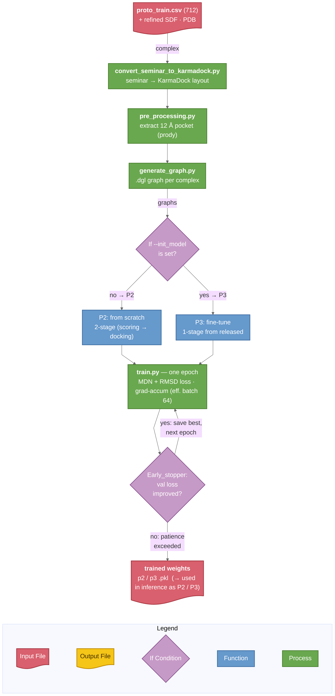
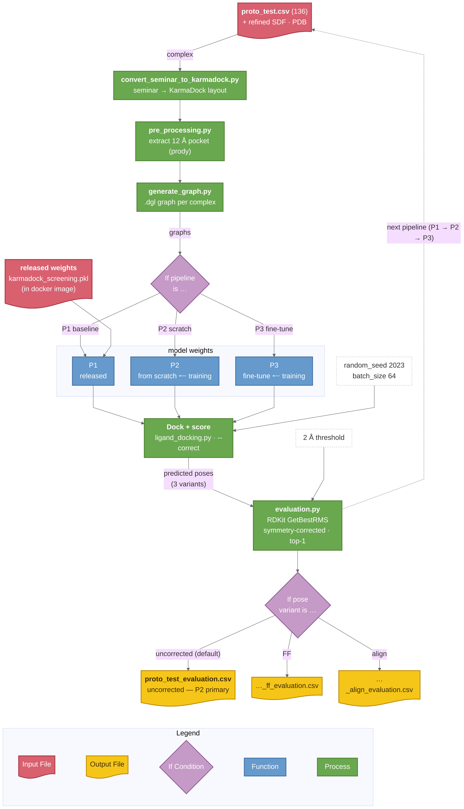

# KarmaDock — Final Submission (full data)

**Benchmarking DL-based Docking Tools** · Saarland University, Summer 2026
supervisors: Hamza Ibrahim, Andrea Volkamer · **Team (KarmaDock): Ahmed, Abdullah**

Docking = given a protein pocket and a small molecule (ligand), predict the ligand's bound
3D **pose**. KarmaDock is a deep-learning docker: it builds protein+ligand graphs, encodes
them (GVP + graph-transformer), **moves** the ligand into the pocket with an E(n)-equivariant
GNN (recycled ×3), and **scores** the pose with a mixture-density network (MDN). It generates
the pose directly instead of searching, so it is ~100–1000× faster than classical docking.
Paper: Zhang et al., *Nat. Comput. Sci.* **3**, 789–804 (2023),
[doi:10.1038/s43588-023-00511-5](https://doi.org/10.1038/s43588-023-00511-5).

---

## Headline — full-data benchmark

We retrained KarmaDock **from scratch** on the full seminar split
(`model/full_scratch_karmadock_team002.pkl`, 2-stage paper protocol) and benchmarked it head-to-head
against the authors' released weights on the **same** `full_test` (6,183) and `posebusters_filtered`
(308) test sets, scored with the official `evaluation.py` (symmetry-corrected top-1 RMSD + PoseBusters).

**top-1 success@2 Å (uncorrected):**

| set | ours (from scratch) | released weights | PB-Valid (ours / released) |
|---|---|---|---|
| full_test (6,183) | **82.2 %** | 88.3 % | 11.5 % / 1.4 % |
| PoseBusters (308) | **76.9 %** | 83.1 % | 5.2 % / 2.6 % |

A consistent ~6-point accuracy gap on both sets (expected — the released weights saw far more training
data), but **our poses are more physically valid** (higher PB-Valid) on both. Full breakdown across all
three pose variants, the ECDF, PoseBusters failure modes and the paper comparison are in
[`notebooks/full_data_results_and_comparison.ipynb`](notebooks/full_data_results_and_comparison.ipynb); see [§3](#3-results).

**Predicted poses** (all 3 variants, both datasets, both models — too large for git) are on Zenodo:
[zenodo.org/records/21197043](https://zenodo.org/records/21197043). The trained **checkpoint** ships
in the repo at [`model/full_scratch_karmadock_team002.pkl`](model/full_scratch_karmadock_team002.pkl) (~15 MB).

---

**Contents:**
1. [What we did & why](#1-what-we-did-and-why-changes-vs-upstream-karmadock)
2. [The three pipelines](#2-the-three-pipelines) — incl. [workflow diagrams](#workflow)
3. [Results](#3-results)
4. [How to evaluate / reproduce](#4-evaluate--reproduce)
5. [Training parameters](#5-training-information--parameters-from-the-paper)
6. [Repository layout](#6-repository-layout)
7. [Issues & fixes](#7-issues--fixes)
---

## 1. What we did, and why (changes vs. upstream KarmaDock)

Public KarmaDock ships **inference + released weights only — there is no training script.**
Our contribution is everything needed to *train* it and to *benchmark* it reproducibly on the
seminar split. The upstream **model, preprocessing, and docking code are used UNMODIFIED** —
this keeps the benchmark faithful to the published method.

| File (ours) | What it is | Why it exists |
|---|---|---|
| [**`scripts/train.py`**](scripts/train.py) | full checkpointed training loop (MDN + docking RMSD losses, 2-stage ) | **our main artifact** — upstream has no trainer; required to train from scratch / fine-tune |
| [`scripts/run_train.sh <scratch/finetune>`](scripts/run_train.sh) | preprocess + train: `scratch` = paper's 2-stage protocol (**P2**), `finetune` = single-stage from the released weights (**P3**) | reproduce the paper's *Training protocol* (Methods, p.801) |
| [`scripts/convert_seminar_to_karmadock.py`](scripts/convert_seminar_to_karmadock.py) | seminar data layout → KarmaDock layout | the seminar's `<id>_ligand_refined.sdf` / `<id>_protein_refined.pdb` files must be re-laid-out for KarmaDock's `pre_processing.py` |
| [`scripts/convert_karmadock_to_seminar.py`](scripts/convert_karmadock_to_seminar.py) | KarmaDock poses → seminar `results/<ds>/<id>_pred.sdf` (best-pose-first) | produce the exact format `evaluation.py` expects |
| [`scripts/run_infer.sh`](scripts/run_infer.sh) | preprocess → dock → export the **3 pose variants** (uncorrected / FF / align) | produce the predicted poses on the cluster |
| [`scripts/evaluate.sh`](scripts/evaluate.sh) | run `evaluation.py` over every pipeline × variant — the separate scoring step | produce the official RMSD CSVs |
| [`scripts/train_ddp.py`](scripts/train_ddp.py) | multi-GPU (DDP) Stage-2 trainer | full-data Stage 2 was too slow single-GPU; run on 2× A100 |
| [`condor/`](condor)`*.sub` | HTCondor docker-universe submit files — prototype (docking + eval + training) and full-data (training, inference, and the 42-job `full_eval_batch.sub`) | run everything on the SIC cluster |
| [`Dockerfile`](Dockerfile) | image → `ahlamloum/karmadock-seminar:v6` | reproducible environment (KarmaDock + RDKit + Torch + other dependencies backed in) |

## 2. The three pipelines

| pipeline | what it is | weights |
|---|---|---|
| **P1 — baseline** | released `karmadock_screening.pkl`, inference only | upstream (in image) |
| **P2 — from scratch** | paper's 2-stage protocol, trained on `proto_train` (712) | [`model/p2_scratch_karmadock_team002.pkl`](model/p2_scratch_karmadock_team002.pkl) |
| **P3 — fine-tune** *(bonus)* | released weights fine-tuned on `proto_train` (712) | [`model/p3_finetune_karmadock_team002.pkl`](model/p3_finetune_karmadock_team002.pkl) |

*Fine-tuning (P3) is a bonus, not a core requirement and still under development.*

### Workflow

**① Training — produces the P2 / P3 checkpoints:**

<a href="docs/workflow_training.png"></a>

*Preprocess `proto_train` (712) into graphs, then train: `--init_model` picks the route — **P2** from scratch (Stage 1 MDN scoring → Stage 2 + docking RMSD) or **P3** fine-tune from the released weights; `Early_stopper` keeps the best epoch as the checkpoint.*

**② Inference & evaluation:**

<a href="docs/workflow_inference.png"></a>

*Run once per pipeline (P1 / P2 / P3): preprocess `proto_test` (136), dock + score with the chosen weights, export the 3 pose variants (uncorrected / FF / align), then score with the official `evaluation.py` (symmetry-corrected RMSD, top-1).*


## 3. Results

### 3.1 Full-data benchmark (primary)

Our submission model is **`full_scratch`** — KarmaDock retrained from scratch on the full seminar
`full_train` split — evaluated against the authors' **released weights** on `full_test` (6,183) and
`posebusters_filtered` (308), for all three pose post-processing variants. Scored with the official
[`evaluation/evaluation.py`](evaluation/evaluation.py) (symmetry-corrected top-1 RMSD + PoseBusters).

**success@2 Å (top-1):**

| set | model | uncorrected | FF | align |
|---|---|---|---|---|
| full_test (6,183) | **ours (from scratch)** | **82.2 %** | 79.3 % | 75.1 % |
| full_test (6,183) | released weights | 88.3 % | 84.9 % | 70.1 % |
| PoseBusters (308) | **ours (from scratch)** | **76.9 %** | 75.6 % | 69.5 % |
| PoseBusters (308) | released weights | 83.1 % | 78.9 % | 68.2 % |

Uncorrected **@1 Å / median RMSD / PB-Valid**: ours (full_test) 48.6 % / 1.03 Å / 11.5 %; released
54.4 % / 0.95 Å / 1.4 %. ours (PoseBusters) 37.0 % / 1.18 Å / 5.2 %; released 39.6 % / 1.16 Å / 2.6 %.

Three findings (full analysis, ECDF and PoseBusters failure-mode breakdown in the
[notebook](notebooks/full_data_results_and_comparison.ipynb)):
1. A consistent **~6-point** accuracy gap to the released weights on *both* sets — a stable property,
   not benchmark noise; expected, since the released weights were trained on far more data.
2. **Our poses are more physically valid** (higher PB-Valid) despite lower raw accuracy — a narrower,
   more homogeneous training split yields locally cleaner geometry.
3. Post-processing (FF, align) **costs** accuracy at full scale (uncorrected > FF > align) for every
   model/dataset — matching the KarmaDock paper's own finding, and resolving the prototype anomaly (§3.2).

Per-complex CSVs (with PoseBusters columns) are in
[`results/full_data_evaluation/`](results/full_data_evaluation). Numbers deterministic (`--random_seed 2023`).

### 3.2 Prototype (`proto_test`, 136 — earlier phase, for context)

The prototype phase trained P2/P3 on the small `proto_train` (712) and scored on `proto_test` (136):

| pipeline | uncorrected | FF-corrected | align-corrected |
|---|---|---|---|
| **P2 — from scratch** | 10.3 % | 11.0 % | 94.1 % |
| P1 — baseline (released) | 80.9 % | 78.7 % | 95.6 % |
| P3 — fine-tune *(bonus)* | 80.1 % | 75.0 % | 94.9 % |

At prototype scale the variant order was *inverted* (align ≫ uncorrected), which we flagged as an open
question. **The full-data run (§3.1) resolves it**: with 6,183 complexes the order matches the paper
(uncorrected > FF > align), so the prototype's 10.3 %/94.1 % split was an artifact of the tiny 136-complex
set (and its reference-frame handling), not a real property of the model. Per-complex prototype CSVs are
in [`results/`](results) (`<pipeline>_<variant>_evaluation.csv`).

The **uncorrected** pose is the raw model output; **FF** is a force-field relaxation; **align**
superimposes the predicted ligand onto the reference frame.

## 4. evaluate / reproduce

Both the predicted poses (shipped **unzipped**) and
the official [`evaluation.py`](evaluation/evaluation.py) result CSVs are included — read the results directly, or re-run the
evaluator on the shipped poses (if needed - locally no cluster needed).

### A. Score the shipped poses
```bash
# one-time setup: unzip the reference structures and let evaluation.py find them
unzip -o data/prototype_model_data.zip -d data/prototype_model_data
ln -sf prototype_model_data/proto_test data/proto_test      # data/proto_test.csv already ships

# score results/proto_test/ (= our from-scratch P2 model) -> results/proto_test_evaluation.csv
python evaluation/evaluation.py --dataset proto_test
```
`results/proto_test/` holds the **from-scratch (P2)** poses — our submission's primary model. To
score a different pipeline/variant, point `results/proto_test/` at it, e.g.
`rm results/proto_test && ln -s p1_baseline/proto_test results/proto_test` then re-run. Pre-computed
CSVs for every pipeline × variant are in [`results/`](results).

### B. Regenerate the poses on the cluster (optional)
```bash
mkdir -p logs
# dock: each job preprocesses, docks (seed 2023) and exports the 3 pose variants
condor_submit condor/p1_baseline.sub        # -> results/p1_baseline/{proto_test,_ff,_align}
condor_submit condor/p2_scratch_infer.sub   # -> results/p2_scratch/...
condor_submit condor/p3_finetune_infer.sub  # -> results/p3_finetune/...
# score (after the 3 docking jobs finish): runs evaluation.py over every pipeline x variant
condor_submit condor/evaluate.sub
```
The subs ([`condor/`](condor)) are **portable** (they transfer the data + our code into the job and use the
released weights baked in the image — no path edits). Docking is deterministic (`--random_seed 2023`)

> The evaluation set is **[`data/proto_test.csv`](data/proto_test.csv) (136 complexes)**. The reference structures come from the bundle. `proto_train` (712) is unchanged.

### C. Full-data evaluation on the cluster (the primary §3.1 results)
The full-data scoring was run as **42 parallel condor jobs** — `full_test` (6,183) is sharded 6 ways per
(model × variant) to fit the queue, plus 3 unsharded PoseBusters jobs per model:
```bash
condor_submit condor/full_eval_batch.sub   # 42 jobs -> per-shard CSVs, then concatenated per combo
```
- [`condor/full_eval_batch.sub`](condor/full_eval_batch.sub) — the 42-job submit file (`queue Item in (...)`).
- [`condor/full_eval_jobs/`](condor/full_eval_jobs) — one `run.sh` per job (exact `evaluation.py` call: dataset, variant, `--shard_idx`/`--num_shards`).
- [`condor/logs/full_data_eval/`](condor/logs/full_data_eval) — the mandatory `.log`/`.err`/`.out` for all 42 jobs.
- Merged per-complex CSVs land in [`results/full_data_evaluation/`](results/full_data_evaluation) (what the notebook reads).

Sharding is the only addition to `evaluation.py` (`--shard_idx`/`--num_shards`, default `0`/`1` = no-op),
so the single-machine commands in A/B are unaffected.

### Retraining from scratch and fine-tuning
Hyper-parameters are in [§5](#5-training-information--parameters-from-the-paper). Prototype drivers:
[`condor/p2_train_scratch.sub`](condor/p2_train_scratch.sub) (P2) and
[`condor/p3_finetune.sub`](condor/p3_finetune.sub) (P3), single-GPU, ~54 h for the 712 `proto_train`
complexes. The **full-data** model was trained with
[`condor/full_train_scratch.sub`](condor/full_train_scratch.sub) (Stage 1) and
[`condor/full_stage2_2gpu.sub`](condor/full_stage2_2gpu.sub) (Stage 2, 2×A100 DDP — see [§5](#5-training-information--parameters-from-the-paper)).

## 5. Training information & parameters (from the paper)

[`train.py`](scripts/train.py) implements the KarmaDock paper's *Training protocol*. Effective batch = 64 in all runs
(`batch_size 4 × accum_steps 16`); train/val split is deterministic (`val_frac 0.1`, `seed 42`).

**P2 — from scratch (2 stages, paper protocol):**

| stage | objective | `pos_r` | optimizer | lr | weight_decay | patience |
|---|---|---|---|---|---|---|
| 1 | scoring / MDN only (EGNN docking skipped) | 0 | Adam | 1e-3 | 1e-5 | 70 |
| 2 | docking + scoring (init from Stage-1 best) | 1 | Adam | 1e-4 | 0 | 70 |

**P3 — fine-tune (bonus, single stage, init = released weights):**
`pos_r 1`, Adam, `lr 1e-4`, `weight_decay 0`, `patience 30`, eff. batch 64, `val_frac 0.1`, `seed 42`.

**Full-data model (`full_scratch`, the §3.1 submission model):** same 2-stage protocol on the full
`full_train` split. Stage 1 (scoring) trained single-GPU; **Stage 2 (docking) ran on 2× NVIDIA
A100-PCIE-40GB via DDP** ([`condor/full_stage2_2gpu.sub`](condor/full_stage2_2gpu.sub) +
[`scripts/train_ddp.py`](scripts/train_ddp.py), condor job 169253), early-stopped at epoch 469, exit 0.
The best checkpoint is [`model/full_scratch_karmadock_team002.pkl`](model/full_scratch_karmadock_team002.pkl);
its per-epoch curve is [`docs/full_stage2_train_log.csv`](docs/full_stage2_train_log.csv).

**pos_r** is the scalar weight on the RMSD (coordinate/docking) loss in KarmaDock's `training
  objective loss = pos_r * rmsd_loss + mdn_loss` — it acts as a positional-refinement switch
  that is set to 0 in Stage 1 (train only the MDN interaction-distance loss) and 1 in
  Stage 2 (turn on the RMSD term to refine predicted ligand coordinates toward the crystal
  pose).

Per-epoch training curves are in [`docs/p2_stage1_train_log.csv`](docs/p2_stage1_train_log.csv),
[`docs/p2_stage2_train_log.csv`](docs/p2_stage2_train_log.csv) and [`docs/p3_finetune_train_log.csv`](docs/p3_finetune_train_log.csv).

## 6. Repository layout

| path | description |
|---|---|
| [`README.md`](README.md) | this file |
| [`Dockerfile`](Dockerfile) | image  (`ahlamloum/karmadock-seminar:v6`) |
| [`scripts/`](scripts) | `train.py` (main artifact), `train_ddp.py` (full-data 2-GPU Stage 2), converters, `run_infer.sh`, `evaluate.sh`, `run_train.sh` |
| [`condor/`](condor) | HTCondor submit files: prototype (docking + eval + training) **and** full-data (`full_train_scratch.sub`, `full_stage2_2gpu.sub`, `full_{test,posebusters}_infer.sub`, `full_eval_batch.sub`) |
| [`condor/full_eval_jobs/`](condor/full_eval_jobs), [`condor/logs/full_data_eval/`](condor/logs/full_data_eval) | the 42 full-data eval `run.sh` wrappers and their `.log`/`.err`/`.out` |
| [`evaluation/evaluation.py`](evaluation/evaluation.py) | seminar evaluator + our PoseBusters and `--shard_idx`/`--num_shards` additions (used for both phases) |
| [`model/`](model) | trained checkpoints (~15 MB each): `full_scratch` (submission), plus prototype P2 + P3 |
| [`notebooks/full_data_results_and_comparison.ipynb`](notebooks/full_data_results_and_comparison.ipynb) | **final submission** notebook: full-data tables, ECDF, PoseBusters, paper comparison, failure analysis |
| [`notebooks/prototype_results_and_comparison.ipynb`](notebooks/prototype_results_and_comparison.ipynb) | prototype-phase notebook (`proto_test`, 136): P1/P2/P3 tables + charts |
| [`results/full_data_evaluation/`](results/full_data_evaluation) | per-complex full-data CSVs (RMSD + PoseBusters) for both models × both sets × 3 variants + ECDF figure |
| [`results/`](results) | prototype poses + `<pipeline>_<variant>_evaluation.csv` |
| [`docs/`](docs) | training logs (incl. `full_stage2_train_log.csv`) + figures |
| [`data/proto_test.csv`](data/proto_test.csv) | proto_test mapping (136 complexes) |
| [`data/prototype_model_data.zip`](data/prototype_model_data.zip) | reference structures: proto_test + proto_train, refined SDF/PDB |
| [`scripts/README.md`](scripts/README.md) | provenance: our code vs. upstream KarmaDock |

**Docker image:** `ahlamloum/karmadock-seminar:v6` (Docker Hub).


## 7. Issues & fixes

- **Node Problem**: in the idun cluster the gpu nodes are sometime during the run just return error so we had to exclude this specific node as a requirement in our sub files.
Fix: exclude it —
  `requirements = … && (Machine =!= "idun.hpc.uni-saarland.de")`.
 **[solved]**.
 - **GPU allocation**: early on, `request_gpus=2/4` jobs sat idle in the queue for days, so the
**prototype** (small `proto_train`) was run **single-GPU**. For the **full dataset** the single-GPU
Stage 2 would have been too slow, so we implemented multi-GPU DDP ([`scripts/train_ddp.py`](scripts/train_ddp.py))
and successfully ran the full-data **Stage 2 on 2× A100-40GB** ([`condor/full_stage2_2gpu.sub`](condor/full_stage2_2gpu.sub),
job 169253, exit 0). Stage 1 stayed single-GPU. **[solved]**
